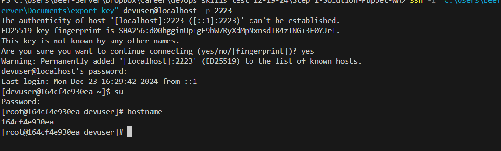
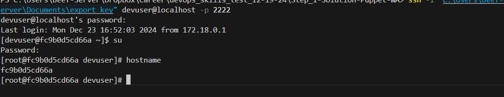
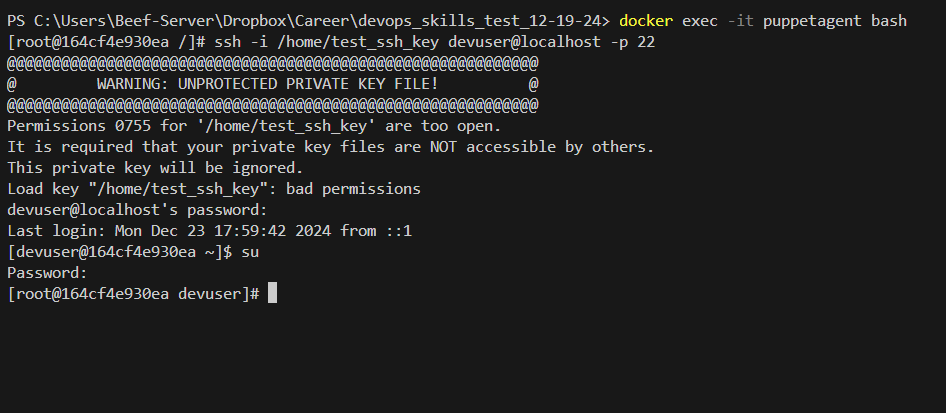
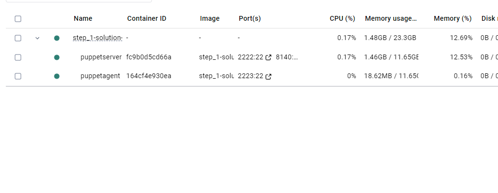

# devops_skills_test_12-19-24

# Skills test #1: Puppet


We use Puppet as our configuration management tool to control the configuration of our internal
and production environment. We use r10k to manage deployment of our configuration code to
our various environments.
Minimal Puppet Skill Test:
Setup two virtual machines with the following characteristics:
1. puppet: Rocky 9, set up as a puppet server using Puppet.
2. agent: Rocky 9, configured as a client of the puppet server.
3. Create a custom module that ensures a user exists on controlled servers, specifying both the
password for that user, and the SSH public key for that user. This will ensure that the user can
use the specified password and SSH key to access both servers. The user should also be in the
wheel group and be able to sudo to root. This module should be used by the puppet server and
applied to both.
Success is achieved by being able to SSH into both servers, and sudo to root with the known
password. The user should have been created by puppet and not by hand on either server.
Variations from the specific steps above which achieve the need to be explained why the
candidate used a different method. Substitution of a different configuration management like say
Ansible won’t suffice because we use Puppet in our environment.


# The approach :
With the flexibility of choice in implementation, we can utilize docker to simplify deployment and maintain tight control of dependencies. Also, we can apply solid concepts of infrastructure as code and version control. VMs are more stable but are very resource intensive, so, as a simple effective use of docker ,in its benefit of behaving as a psuedo vm,  we can utlize it to demonstrate the merits of this exercise. Which, for the first part to my understanding is to be a demonstration a of puppet server and its associated agent server, and their ability to have ssh access from an external resource as well each other as well as a shared module in between. With that in mind:

Each of the puppet instances above will be represented as a docker image set up on an image of rocky 9. Upon contatiner spin-up both servers will have the ability to have ssh access from the admin. Upon initial access and test run of module a user will be created with necessary access privillages through puppet. Included Docker-comopose will handle container orchastration and management. 

# Requirements: 

Docker

## 1 - 2 : To set up a puppet server and agent :
Please refer to DockerFiles under 
devops_skills_test_12-19-24/Step_1-Solution-Puppet-WA/

   - COPY field will pull necessary files for the task. This includes the modules needed for the puppet server, agent and ssh configs 
   - RUN section will lay out order of operations and initial package setup and install 
   - The rest of the parts of the DockerFile includes port information and exposure and other necessary commands for sercvices 


## 3 : Custom module
Please refer to files under 
devops_skills_test_12-19-24/Step_1-Solution-Puppet-WA/puppet-modules/

  -  init.pp contains information about how to create a test user called "devuser" and also contains protected user information and public ssh key for access


## 4 : Setup and test 
- Deploy dockerfiles via docker compose 

- Access both containers via shell 

  ```
  docker exec -it puppetagent bash
  docker exec -it puppetserver bash 
  ```
  
- run the puppet agent on both containers
  ```
  puppet agent -t
  ```
- Should get some verification output: 
  ```
  docker exec -it puppetagent bash
  [root@164cf4e930ea /]#   puppet agent -t

  Info: Using environment 'production'
  Info: Retrieving pluginfacts
  Info: Retrieving plugin
  Notice: Requesting catalog from puppet:8140 (172.18.0.2)
  Notice: Catalog compiled by fc9b0d5cd66a
  Info: Caching catalog for 164cf4e930ea
  Info: Applying configuration version '1734975345'
  Notice: Applied catalog in 0.04 seconds
  ```


- Apply the module to both nodes, Add test user and Trigger a run : 
  ```
  puppet agent --test  
  ```


## Verification

- Accessing from local to puppet-server: 
  ```
  ssh -i "<ENTER KEY PATH>" devuser@localhost -p 2222
  ```

  
- Accessing from local to puppet-AGENT: 
  ```
  ssh -i "<ENTER KEY PATH>" devuser@localhost -p 2223
  ```
  
- Accessing puppet-server from agent: 
  ```
  docker exec -it puppetagent bash
  ssh -i /home/test_ssh_key devuser@localhost -p 22
  ```



