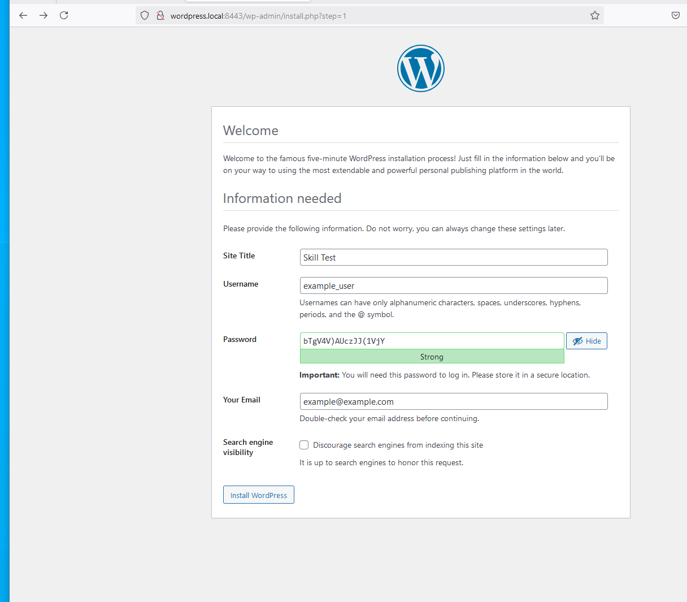

# devops_skills_test_12-19-24

# Skills test #2: Wordpress, Static website  and MariaDB   

The requirements asked for a static website and a wordpress website running on rocky linux 9 with their own custom url with an adjunct maria db server. 


# The approach :
As a smilliar approach to step 1. Dockerfiles are provided which will create rocky linux 9 box and serve as web01 service. Also included are the necessary .conf files which will be written to their destination during container spin up. 

 - Dockerfile.db01 contains db container based on image of mariadb with other necessary packages installed 
 - Dockerfile.web01 contains wordpress installation instructions on top of rocky 9 and instructions to install necessary config packages which are provided  
 - custom_sites.conf contains custom URL mapping which will be applied (staic.local and wordpress.local)
 - httpd.conf contains apache server ports and listening instructions 
 - docker-compose will handle container orchestration, port mapping and network management 

# Requirements: 

Docker

## Implementation steps :
  - Deploy the images using Docker Compose and navigate to 
```
  http://static.local:8080/         to navigate to the static website index.html (included)
  http://wordpress.local:8443/      to navigate to the wordpress (verification below)
``` 
  - *Note: MariaDB container needs to be running for wordpress to work or else database error will be shown 


## Verification


